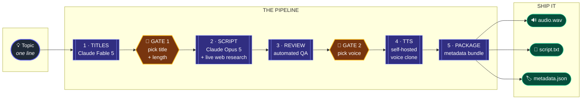
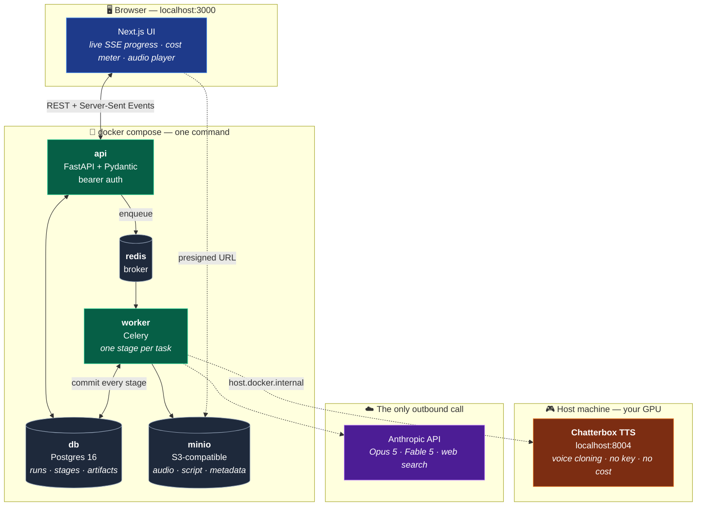
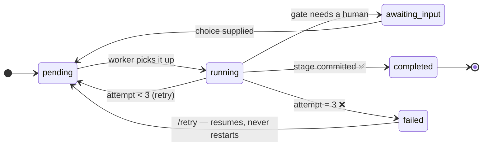

<div align="center">

# 🎙️ ScriptCast

### A topic goes in. A finished, narrated, upload-ready video script comes out.

**ScriptCast is a durable, fault-tolerant content pipeline that turns a one-line idea into a researched narration script, a cloned-voice audio track, and a publish-ready metadata bundle — running entirely on one machine, with the narration synthesized locally for $0.00.**

<br>

[](https://www.youtube.com/@mousaabuzar125)

### 📺 Not a demo — this pipeline writes and narrates the videos on **Cosmic Quests** ([**@mousaabuzar125**](https://www.youtube.com/@mousaabuzar125)), which has passed **1,000+ views**.

<br>

[](https://python.org)
[](https://fastapi.tiangolo.com)
[](https://docs.celeryq.dev)
[](https://postgresql.org)
[](https://nextjs.org)
[](https://claude.com)

[](#-tests)
[-blue?style=flat-square)](#-the-zero-cost-voice)
[](#-no-key-no-network-no-spend)
[](#)
[](https://www.youtube.com/@mousaabuzar125)

**[▶️ Watch a run](#-watch-it-run)** · **[📂 See the output of a real run](examples/)** · **[📺 The channel it publishes to](https://www.youtube.com/@mousaabuzar125)**

</div>

---

## 🎬 Watch it run

<!-- TODO: drag your recording into a GitHub issue comment, copy the URL it
     generates, and paste it below to replace this block. -->

> *Recording coming — drop the video here.*

**Topic in → titles → script → narration, in about four minutes.**

Prefer to read the output instead? Every file from that exact run is committed
in **[`examples/`](examples/)** — the five title candidates with the argument
for each, the researched script, the QA findings, the finished audio, and the
upload metadata. Nothing hand-edited.

---

## 🚀 This isn't a demo. It's in production.

ScriptCast is **the actual production pipeline behind a real, live YouTube channel — [Cosmic Quests](https://www.youtube.com/@mousaabuzar125)** — a long-form educational science channel. Every video published there starts as a single line typed into this UI and ends as a `.wav` file and a metadata bundle rendered by this pipeline, on a laptop, in the next room.

Videos scripted and narrated by this pipeline have **generated over 1,000 views on the channel** — real output, in front of a real audience, not a demo reel.

That constraint shaped every design decision in this repo:

| Because it ships real videos… | …the system had to |
|---|---|
| Runs take **20–40 minutes** end to end | Be fully async, durable, and resumable — never an HTTP request |
| A crash mid-run would waste **real GPU hours and real API spend** | Commit every stage to Postgres and resume at the first incomplete step |
| A human has to **approve the title and the voice** | Park the pipeline mid-flight on a gate, then release it |
| A runaway loop could quietly burn **real money** | Enforce a hard per-run dollar ceiling *before* each stage starts |
| The narration is a **real channel's voice** | Self-host TTS with voice cloning, so cost per run is literally zero |

---

## 🧬 The Pipeline

Five stages. Two human gates. Every transition is a committed database row.



### What each stage actually does

| # | Stage | Job | Notes |
|:-:|---|---|---|
| **1** | `titles` | Generates 5 genuinely different title candidates | Each ships with **the case for choosing it**, plus a named recommendation and a comparative argument for *why it beats the other four*. The pick is a briefing, not a coin flip. |
| **🚦** | *gate* | **You choose** the title and the length | Length is requested in **minutes of narration** — the unit that matters — and converted to a word target at 150 wpm. |
| **2** | `script` | Writes the full narration | **Searches the live web first**, so the script is grounded in current figures and real sources rather than recalled knowledge. Records how many searches it ran, so you know whether to trust a specific number. |
| **3** | `review` | Automated QA gate before you pay for synthesis | Hunts for markdown a narrator would read aloud, invented figures, fabricated quotations, and second speakers. **Advisory by design** — it records findings and lets the run continue, because a stuck run is worse than a flagged one. |
| **🚦** | *gate* | **You choose** the voice | |
| **4** | `tts` | Synthesizes the narration | Self-hosted voice clone on a local GPU. The UI shows a **countdown projected from your own machine's measured throughput**, taken from the median of your last runs — not a hardcoded guess. |
| **5** | `package` | Bundles upload-ready metadata | Title, alternates, word count, runtime, review findings, and a **mandatory synthetic-narration disclosure** — the thing platforms require you to declare on upload. |

---

## ⚙️ How it runs on one machine

Everything below runs locally. The only thing that leaves the laptop is the LLM call.



**Reference machine:** Windows 11, laptop RTX 4050 (6 GB VRAM), Docker Desktop + WSL2. Measured synthesis throughput: **~5.2 characters/second** — a 1,200-word script lands in roughly 20 minutes. The pipeline is async and every stage is committed, so a slow stage is a slow stage, not a broken one.

---

## 🛡️ The engineering that makes it survive real use

### One stage per task — the core of the whole design

The worker executes exactly **one stage**, commits it, and re-enqueues itself for the next. That single decision buys three properties at once:



| Property | How | Why it matters here |
|---|---|---|
| 🧷 **Crash safety** | The next stage is a pure function of `STAGE_ORDER` and the first non-completed row | Kill the worker mid-run and you lose **at most one stage**, never the run |
| ♻️ **Idempotency** | Every stage stores a **SHA-256 hash of its inputs** | A retry with unchanged inputs **replays the stored output instead of paying a vendor again**. Change the model, the length, or a voice knob and the hash changes — so it correctly *re*-runs |
| 🔍 **Observability** | Progress lives in Postgres, not in worker logs | The UI, the API and the SSE stream can **never disagree** about where a run is |

### 💸 A budget guard that actually stops the money

Not advisory. Enforced at three layers:

1. **Before a stage starts** — the runner computes that stage's *worst-case* cost (every allowed output token billed at the output rate, every allowed web search performed) and **refuses to start it** if the remaining budget can't cover it. It fails with a message naming the number.
2. **Inside a single call** — the LLM adapter aborts mid-flight if a server-side tool loop crosses the ceiling, raising a typed `BudgetExceeded` so callers can tell *"this broke"* from *"we ran out of money"*.
3. **After the fact** — a backstop halts the run if realized spend crosses the line anyway, keeping the completed work on record.

Default ceiling: **$3.00/run** — a runaway guard, not a normal constraint. For scale: the [committed example run](examples/) — a researched 2-minute script with 4 live web searches — cost **$0.57**, nearly all of it the search results coming back into the context window.

### 🔌 A provider abstraction that earned its keep

`providers/base.py` defines two Protocols — `LLMProvider` and `TTSProvider`. **Nothing above that layer imports a vendor SDK.** Adding a vendor is one new file plus one line in `registry.py`; the pipeline, API, and tests are untouched.

This wasn't theoretical. Swapping a paid hosted TTS vendor for **a GPU in the next room** was exactly one new file (`tts_local.py`) and one line in the registry. Nothing else changed.

### 🎧 The zero-cost voice

`TTS_PROVIDER=local` points the pipeline at a [Chatterbox](https://github.com/devnen/Chatterbox-TTS-Server) server on your own hardware. It **clones a narration voice from a 15–30 second sample**, needs no account and no API key, and reports a synthesis cost of `$0.00` — which is literally true, not rounded. The only spend left in a run is the Claude calls; the [example run](examples/) came in at **$0.57** for a researched 2-minute script.

The generation knobs are a deliberate house style, not the server's defaults: steadier than stock so delivery doesn't drift between the chunks of a 30-minute narration, and considerably more expressive so it reads as documentary rather than flat. Long scripts are split across bounded HTTP requests, so a network blip costs one chunk instead of an hour of synthesis.

Full setup: [`docs/local-tts.md`](docs/local-tts.md).

### 🧪 No key, no network, no spend

Both provider families ship **offline fakes that produce real, well-formed output** — the TTS fake emits a playable WAV sized to the script. So the entire pipeline, and the entire test suite, runs with no API key, no network, and no spend.

That's why a fresh `git clone` works immediately, and why CI can exercise every stage on every commit.

---

## ⚡ Quickstart

```bash
git clone https://github.com/MousaAbuzar/Social-Media-Hackathon-Submission.git
cd Social-Media-Hackathon-Submission

cp .env.example .env          # defaults run fully offline — no keys needed
docker compose up --build
docker compose exec api alembic upgrade head
```

| Service | URL | |
|---|---|---|
| 🖥️ **UI** | http://localhost:3000 | Start here |
| 📚 **API docs** | http://localhost:8000/docs | Interactive OpenAPI |
| 🗄️ **MinIO console** | http://localhost:9001 | `minioadmin` / `minioadmin` |

The UI reads `APP_TOKEN` from `.env` at startup — nothing to paste in. Changing it means restarting the `web` container.

### Turning on the real thing

```bash
# Real scripts, real research
ANTHROPIC_API_KEY=sk-ant-...
LLM_MODEL=claude-opus-5        # the script stage
TITLES_MODEL=claude-fable-5    # titles get the strongest model — it's a ~2k-token call
SCRIPT_WEB_SEARCH=true         # ground the script in live sources

# Real narration, zero cost — see docs/local-tts.md
TTS_PROVIDER=local
TTS_LOCAL_URL=http://host.docker.internal:8004
```

<details>
<summary><b>🔧 Local gotchas worth knowing</b></summary>

<br>

**Port 3000 taken?** Set `WEB_PORT=3006` in `.env` *and* add the matching origin to `CORS_ORIGINS` — the API rejects browser requests from origins it doesn't list.

**Why two S3 endpoints?** They're reached from different places. `S3_ENDPOINT_URL` is how the API talks to MinIO *inside* the Compose network; `S3_PUBLIC_ENDPOINT_URL` is what download URLs are *signed against*. A presigned URL's signature covers the host — sign with the internal hostname and you produce links no browser can open.

**TTS URL:** use `host.docker.internal:8004` from inside Compose, `localhost:8004` when running the backend natively. Rule of thumb: match whatever `DATABASE_URL` already uses.

**Starting the backend from `backend/`?** `env_file` is a relative path, so it silently falls back to the defaults in `config.py` — meaning `TTS_PROVIDER=fake` and silent WAVs, with nothing in the log to explain why. Start from the repo root.

</details>

---

## 🧠 The prompts are the product

The orchestration is the engineering; the prompts are the craft. They live in one module (`pipeline/prompts.py`) so every change is reviewable as a diff and versionable alongside results.

- **Titles** are held to a hard rubric — 45–60 characters, front-loaded subject, real search terms — and then put through a **curiosity-gap test that kills most candidates**: *after reading it, can the viewer walk away feeling they already got the point? If yes, it's dead. Rewrite it.*
- **Scripts** are written for the ear, not the page: one idea per sentence, every big number immediately translated into something a body can feel, a hook every sixty seconds, and a ladder structure where each rung makes the last one feel small. Research happens **before** the first word of narration, and **must not show** — no citation markers, no "according to a 2023 paper", no source lists getting read aloud.
- **Review** knows the house style is intentional and doesn't flag it — it hunts only for the expensive failures: markdown a narrator would speak, fabricated quotations, invented figures, and a second speaker sneaking into a one-person format.

---

## ✅ Tests

```bash
cd backend
pip install -e ".[dev]"
pytest
```

**123 tests, no services required.** The ORM types are deliberately portable, so orchestration tests run on in-memory SQLite — contributors get a green suite without standing up a database. They cover a full run to completion, artifact recording, the input-hash cache skip, mid-pipeline resumability, budget enforcement, and cost accumulation.

Set `TEST_DATABASE_URL` to run the same suite against Postgres. **CI does exactly that**, so the deployment engine is covered too.

---

## 🗂️ Layout

```
backend/
  app/
    api/          FastAPI routes, bearer auth, SSE event stream
    pipeline/
      stages.py   the work — pure-ish functions, no DB, no Celery
      runner.py   the orchestration — gates, hashing, budget, retries
      prompts.py  the craft
    providers/    Protocols · vendor adapters · offline fakes · registry
    models.py     Run / Stage / Artifact + the stage state machine
    worker.py     Celery app and the advance-one-stage task
  alembic/        versioned migrations
  tests/          123 tests, zero services
frontend/         Next.js + TypeScript UI with live SSE progress
docs/local-tts.md self-hosted GPU narration setup
```

**The seam that makes it testable:** stages never touch the database or the Celery API. They read a `StageContext`, do work, return a `StageResult`. The runner owns all persistence, gating, hashing, budget and retry policy. That's why the entire pipeline can be exercised without either.

---

## ⚖️ Responsible synthetic media

The `package` stage **always** writes a synthetic-narration disclosure into the metadata bundle — the declaration platforms require on upload. The review stage flags any attempt to claim to *be* a real named person, and flags every quotation attributed to a real human for verification.

On voices: cloning a real person's voice to test a pipeline on your own machine is one thing. Publishing it as them is a publicity-rights problem no disclosure label solves. Use an original or licensed voice for anything you ship.

---

## 🚧 Deliberately not built

Scope discipline is a feature. These are absent on purpose:

- **Multi-user auth.** Single bearer token. This is a personal production tool, not a SaaS.
- **Video assembly.** Audio and metadata out; editing stays a human decision.
- **An eval harness for script quality.** The `review` stage is the seed of one — it's advisory today, and scoring its findings against a labeled set is the obvious next step.

---

<div align="center">

**Built for a hackathon. Already shipping videos — and 1,000+ views.**

<sub>Topic in. Narrated audio out. The interesting part was never the API calls — it was the orchestration around them.</sub>

</div>
